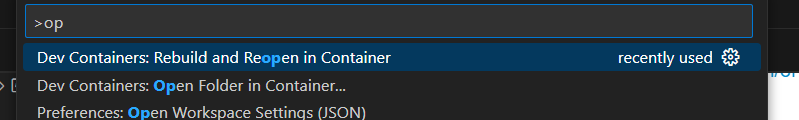
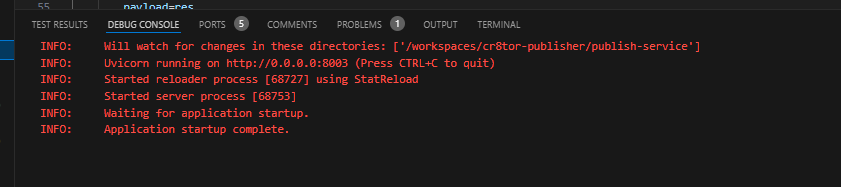
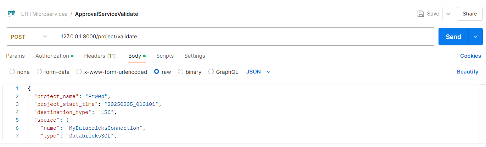

# CR8TOR Approval Service

The FastAPI based microservice supporting the [CR8TOR solution](https://github.com/lsc-sde-crates/cr8tor).

More description and Configuration details at [Service guide](./docs/service.md).

## Developer Guide

Please take the time to familiarize with the required [Configuration](./docs/service.md).

### Setting up a local environment

Pre-requisites:

1) Visual Studio Code with extensions:
   * <https://marketplace.visualstudio.com/items?itemName=ms-vscode-remote.remote-wsl>
   * <https://marketplace.visualstudio.com/items?itemName=ms-vscode-remote.remote-containers>
   * <https://marketplace.visualstudio.com/items?itemName=ms-azuretools.vscode-docker>
2) WSL2
   * <https://learn.microsoft.com/en-us/windows/wsl/install>
3) Docker Desktop
   * <https://learn.microsoft.com/en-us/windows/wsl/tutorials/wsl-containers#install-docker-desktop>
4) Optionally, as Docker alternative, Podman.
   * <https://github.com/containers/podman/blob/main/docs/tutorials/podman-for-windows.md>
   Make sure to replace default `docker` with `podman` value in VSCode settings Ctrl+Shift+P: Dev Containers: Settings: Remove > Containers: Docker Path.
5) Follow [Docker Networking configuration](./docs/service.md#docker-network)

Basic steps to spin up local environment:

1) Clone the repository
2) VSCode should recognize automatically the DevContainer and pop up the hint to open it. Alternatively, Ctrl+Shift+P >Dev Containers: Open Folder in Container, and choose the main repo folder or .devcontainer folder.
   You can also choose Rebuild and Reopen in Container.

3) DevContainers will pull the required docker image, build it and start the container.
   Once the container is running, by default postCreate command will run `uv sync` and
   install all required python packages and open the terminal in virtual environment.
4) Start Debug mode (F5) to activate the FastApi server which will listen to the calls.
   
5) Use eg. Postman to send POST Rest requests.
   

### Useful commands

Analyse duckdb database:

    import duckdb
    conn = duckdb.connect("outputs/lsc-sde/staging/Pr005/20250205_010101/data/outputs/database.duckdb")
    conn.sql("DESCRIBE p_abx.procedure_occurrence").show()
    conn.sql("SELECT * FROM p_abx.procedure_occurrence").show()
    conn.close()

### Working with Docker

If we want to build locally the docker images and containers, without DevContainer,
we can use below commands. For podman, replace `docker` with `podman`.

If we want to build locally the docker images and containers, without DevContainer, we can use below commands. For podman, replace `docker` with `podman`.

    docker build -t approval-service .
    docker run -d --name approval-container --network=microapps-network -p 8000:8000 localhost/approval-container

    docker build -t metadata-service .
    docker run -d --name metadata-container --network=microapps-network -p 8002:8002 localhost/metadata-service

    docker build -t publish-service .
    docker run -d --name publish-container --network=microapps-network -p 8003:8003 localhost/publish-container

If we mounted secrets to Docker Volume, we can specify the volume path when running container:

    docker run -d -v secrets:/mnt/ -e SECRETS_MNT_PATH="/mnt/secrets/" --name approval-container --network=microapps-network -p 8000:8000 approval-service

    docker run -d -v secrets:/mnt/ -e SECRETS_MNT_PATH="/mnt/secrets/" --name metadata-container --network=microapps-network -p 8002:8002 metadata-service

    docker run -d -v secrets:/mnt/ -e SECRETS_MNT_PATH="/mnt/secrets/" --name publish-container --network=microapps-network -p 8003:8003 publish-service

Helpful Docker commands:

* docker rm publish-container

### Troubleshooting

#### Podman/WSL and DevContainer

Resolving known issues with Podman or WSL:

1. Make sure that `.ssh` folder exists in your Users default folder, even if folder is empty. E.g. `C:\Users\<Some.User>\.ssh`
2. Ctrl+Shift+P -> DevContainers -> Settings: replace docker with podman in default app to run
3. TLS certificate errors spinning up container

    * install certificate following guidelines <https://github.com/containers/podman/blob/main/docs/tutorials/podman-install-certificate-authority.md>
    * or alternatively, "whitelist" the domain so the certificate will not be checked for this. Use this only in development mode on known domains if installing certificate is not resolving the issue.
    1) login to WSL distro (<https://github.com/containers/podman/blob/main/docs/tutorials/podman-for-windows.md#using-the-wsl-command>)
    2) add a new conf file, which will specify the domain we do not want to verify certificates (known domain).
    sudo nano /etc/containers/registries.conf.d/ghcr.conf
    content:
        `[[registry]]`
        `location="ghcr.io"`
        `insecure=true`
    3) also, add the similar config in Windows:
		C:\Users\YOUR_USERNAME\.config\containers\registries.conf
	4) restart Podman, for example in Podman UI
4. TLS certificate errors executing `uv sync` command
   * add to pyproject.toml
   `[tool.uv]`
   `allow-insecure-host = ["github.com"]`
   * add to .devcontainer.json `GIT_SSL_NO_VERIFY=true` before uv sync command
5. Images are not pulled automatically and recognized by VSCode. Either run the command manually, or open Podman Desktop and pull required images. Command:
    `podman pull ghcr.io/astral-sh/uv`
6. Add to .devcontainer
`"runArgs": [
  "--userns=keep-id:uid=1000,gid=1000"
 ],
 "containerUser": "vscode",
 "updateRemoteUserUID": true,
 "containerEnv": {
   "HOME": "/home/vscode"
 }`
7. Login to WSL. Update the package repositories:
`sudo dnf update -y`. Check git version. Install if missing:

    git --version
    sudo dnf install -y git

#### Podman commands
    podman machine start

    podman build -t approval-service .
    podman build -t metadata-service .
    podman build -t publish-service .

    podman run -d -v secrets:/mnt/secrets/ -e SECRETS_MNT_PATH="/mnt/secrets/" --name publish-container --network=microapps-network -p 8003:8003 publish-service

    podman run -d -v secrets:/mnt/secrets/ -e SECRETS_MNT_PATH="/mnt/secrets/" --name approval-container --network=microapps-network -p 8000:8000 approval-service
    
    podman run -d -v secrets:/mnt/secrets/ -e SECRETS_MNT_PATH="/mnt/secrets/" --name metadata-container --network=microapps-network -p 8002:8002 metadata-service

Executing commands on running container:

    podman exec publish-container ls outputs/nw-sde/

    podman exec publish-container ls .dlt/pipelines/dlt_Pr005_NW/normalize

    podman exec publish-container ls .dlt/pipelines/dlt_Pr005_NW/normalize/30d2856cc5123f3f/

    podman exec publish-container ls .dlt/pipelines/dlt_Pr005_NW/normalize/30d2856cc5123f3f/1739404960.306188/new_jobs

    podman exec publish-container ls outputs/nw-sde/staging/Pr005/20250205_010101/data/outputs/p_abx -l -h

#### Podman volume mounting
    podman run --name temp_container -v secrets:/secrets alpine sleep 10

    podman machine ssh "podman cp /mnt/c/Users/<user.folder>/<path_to_secrets_folder>/secrets/     temp_container:/secrets"

    podman rm -f temp_container