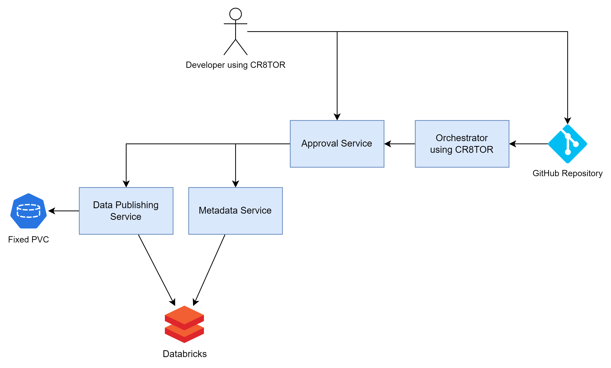

# CR8TOR Microservices



Microservices are used by the [CR8TOR solution](https://github.com/lsc-sde-crates/CR8TOR) to facilitate Data Access Request to the Trusted Research Enviornment (TRE), by coordinating:

1) Retrieving dataset metadata (e.g. table-column level descriptions) for further validation and approval stages
2) Retrieving and packaging the requested dataset in the chosen file format and
3) Publishing dataset to target destination storage account (TRE)

There are three services created:

1. Approval Service which acts as an API gateway, taking the requests from the outside world and forwarding them to the relevant service.
   [See detail docs for Approval Service](../approval-service/docs/service.md).
2. Metadata Service which fetches the dataset's metadata, like table-column level descriptions, data types, names.
   [See detail docs for Metadata Service](../metadata-service/docs/service.md).
3. Publish Service which retrieves the dataset, packages in requested format and publishes to target destination.
   [See detail docs for Publish Service](../publish-service/docs/service.md).

## Authentication

Authentication for all microservices is implemented through a static API key. The API key is stored as an environment variable and validated for each request. The key must be provided using the `Header` method:

- Header - include key `x-api-key` containing the token.

Each service has dedicated environment variable which should be stored in secret vault, (e.g. Azure Key Vault):

- publishserviceapikey for Publish Service
- metadataserviceapikey for Metadata Service
- approvalserviceapikey for Approval Service

## Docker network

The microservices (Approval, Metadata and Publish) need to communicate with one another and currently, are configured to work on a **docker user defined network named `microapps-network`**.

To create the network, run the command:
   `docker network create microapps-network`

Currently, microservices are set up with the following default configuration:

| Service Name     | Exposed Port | Default Container Name  |
|------------------|--------------|-------------------------|
| ApprovalService  | 8000         | approval-container      |
| MetadataService  | 8002         | metadata-container      |
| PublishService   | 8003         | publish-container       |

## Databricks Service Principal

Metadata and Publish Service use the [Databricks Workspace Service principal](https://learn.microsoft.com/en-gb/azure/databricks/admin/users-groups/service-principals#manage-service-principals-in-your-workspace) to connect to the Databricks Unity Catalog.

At the moment, the creation of service principal (SPN) is not automated and requires Databricks Workspace Admin permissions.

Once the service principal is created [see docs](https://learn.microsoft.com/en-gb/azure/databricks/admin/users-groups/service-principals#add-a-service-principal-to-a-workspace-using-the-workspace-admin-settings) we need to:

1. Add the following secrets to the chosen key vault resource, e.g., Azure KeyVault:
   - `databricksspnclientid` which contains spn ClientID
   - `databricksspnsecret` which contains the secret generated in Databricks for the given service principal

2. Grant service principal access to the SQL Warehouse cluster. Minimum required permission: CAN USE. 
   Follow [Databricks docs](https://learn.microsoft.com/en-gb/azure/databricks/compute/sql-warehouse/create#manage-a-sql-warehouse) to add the permission.

3. Grant service principal access to the requested datasets. At minimum:
   - ``GRANT USE CATALOG ON CATALOG <catalog_name> TO `<spn_client_id>` ``
   - ``GRANT USE SCHEMA ON SCHEMA <full_schema_name> TO `<spn_client_id>` ``
   - ``GRANT USE SELECT ON SCHEMA <full_schema_name> TO `<spn_client_id>` ``

## Installation onto Kubernetes
To install this on our dev environment we performed the following actions.

### Secrets
The service will need access to secrets via volume mounts. The helm chart requires a volume to be mounted as part of the volume section of the helm config:

First though, as our dev environment uses azure keyvault, and as we're using a separate keyvault from the one used by our secrets distributor, in this case we're going to hook it up directly. As a result, we will need a secret provider class:
```yaml
apiVersion: secrets-store.csi.x-k8s.io/v1
kind: SecretProviderClass
metadata:
  name: cr8tor
  namespace: cr8tor-publisher
spec:
  provider: azure
  parameters:
    usePodIdentity: "false"
    useVMManagedIdentity: "true"                        # Set to true for using managed identity
    userAssignedIdentityID: "00000000-0000-0000-0000-000000000000"   # Set the clientID of the user-assigned managed identity to use
    keyvaultName: your-keyvault-name                # Set to the name of your key vault
    
    # The following is a list of all of the secrets made available from the keyvault
    objects:  |
      array:
        - |
          objectName: approvalserviceapikey
          objectType: secret
        - |
          objectName: metadataserviceapikey
          objectType: secret
        - |
          objectName: publishserviceapikey
          objectType: secret
        - |
          objectName: databricksspnclientid
          objectType: secret
        - |
          objectName: databricksspnsecret
          objectType: secret
    tenantId: "00000000-0000-0000-0000-000000000000"      # The tenant ID of the key vault
```
### TLS Certificate
Additionally, we're going to want our SSL Certificate, this can come from the secrets distributor as our wildcard certificate is in there already:

```yaml
apiVersion: xlscsde.nhs.uk/v1
kind: SecretsDistribution
metadata:
  annotations:
    xlscsde.nhs.uk/secretUsage: Wildcard Certificate
  name: dev-cr8tor.xlscsde.nhs.uk-tls
  namespace: cr8tor-publisher
spec:
  name: dev-cr8tor.xlscsde.nhs.uk-tls
  secrets:
  - from: WildcardCertificate
    to: tls.crt
  - from: WildcardCertificateKey
    to: tls.key
  type: kubernetes.io/tls
```
If you're not using the secrets distributor you'll have to supply your own secret for this.

### Storage Classes
The service currently has need of 4 storage classes to function correctly:
* cr8tor-lsc-staging
* cr8tor-lsc-prod
* cr8tor-nw-staging
* cr8tor-nw-prod

Please note: These names are configurable via the helm chart configuration, however these are the defaults.

These will all need to be configured according to your own needs. In our case however as we're using azure, we're going to hook them up to the azure file share CSI driver on a pre-existing storage account. Example below:


```yaml
apiVersion: storage.k8s.io/v1
kind: StorageClass
metadata:
  name: cr8tor-lsc-staging
provisioner: file.csi.azure.com
parameters:
  skuName: Standard_ZRS
  location: uksouth
  storeAccountKey: "true"
  storageAccount: yourstorageaccount
  server: yourstorageaccount.privatelink.file.core.windows.net
  resourceGroup: yourresourcegroup
  shareName: cr8tor-lsc-staging
  secretName: cr8tor-lsc-staging-int
  secretNamespace: cr8tor-publisher
allowVolumeExpansion: true
reclaimPolicy: Retain
volumeBindingMode: Immediate
mountOptions:
  - dir_mode=0777
  - file_mode=0777
  - uid=1000
  - gid=100
  - mfsymlinks # Enable support for Minshall+French symlinks 
  - cache=strict # https://linux.die.net/man/8/mount.cifs
  - actimeo=30 # reduce latency for metadata-heavy workload
  - nosharesock # reduce probability of reconnect race
```

### Helm Chart Configuration
Once you've got all the above prequisites in place you can then create a helm chart configuration, not forgetting to add in the volume for the secrets-store-inline. Example below:

```yaml helm-config.yaml
approvalService:
  image: ghcr.io/lsc-sde-crates/cr8tor-publisher/cr8tor-approval-service:latest
  volumes:
  - name: secrets-store-inline
    csi:
      driver: secrets-store.csi.k8s.io
      readOnly: true
      volumeAttributes:
        secretProviderClass: "cr8tor"

metadataService:
  image: ghcr.io/lsc-sde-crates/cr8tor-publisher/cr8tor-metadata-service:latest
  volumes:
  - name: secrets-store-inline
    csi:
      driver: secrets-store.csi.k8s.io
      readOnly: true
      volumeAttributes:
        secretProviderClass: "cr8tor"

publishService:
  image: ghcr.io/lsc-sde-crates/cr8tor-publisher/cr8tor-publish-service:latest
  volumes:
  - name: secrets-store-inline
    csi:
      driver: secrets-store.csi.k8s.io
      readOnly: true
      volumeAttributes:
        secretProviderClass: "cr8tor"

ingress:
  enabled: true
  annotations:
    nginx.ingress.kubernetes.io/ssl-redirect : "true"
    nginx.ingress.kubernetes.io/force-ssl-redirect : "true"
    nginx.ingress.kubernetes.io/proxy-body-size: 64m
    xlscsde.nhs.uk/dns-record: cr8tor
  className: nginx
  host: dev-cr8tor.xlscsde.nhs.uk
  tls:
    secretName: dev-cr8tor.xlscsde.nhs.uk-tls
```

#### Storage Configuration
Please note that the default behaviour is that helm chart will create the various PVC's based upon the storage classes provided, if you wish to create these manually, you can do so by amending the helm configuration.

```yaml
storage: 
  lsc:
    pvcs:
      staging:
        name: lsc-staging
        create: false

      production:
        name: lsc-prod
        create: false
  nw:
    pvcs:
      staging:
        name: nw-staging
        create: false

      production:
        name: nw-prod
        create: false
```

#### Ingress Configuration
The helm chart is configured for use with NGINX however you may chose to use a different ingress provider and change the settings in the helm configuration

```yaml
ingress:
  enabled: true
  annotations:
    some-ingress.io/some-variable: "some-value"
  className: some-ingress-class-name
  host: dev-cr8tor.some.org
  tls:
    secretName: dev-cr8tor.some.org-tls
```

If the standard configuration is not flexible enough, you can of course choose to disable the ingress and configure yourself

```yaml
ingress:
  enabled: false
```

### Helm Chart Install

Once you've created your yaml config, you can run a helm install/upgrade:

```bash
helm repo add iac-helm-repository https://lsc-sde.github.io/iac-helm-repository/
helm repo update

helm upgrade cr8tor-publisher iac-helm-repository/cr8tor-publisher --install --create-namespace -n cr8tor-publisher -f helm-config.yaml
```


### Verifying Installation
Once the installation is completed you can check that the services are online by checking the pods list in kubectl

```bash
kubectl get pods -n cr8tor-publisher
```

Expected output:

```
NAME                                         READY   STATUS    RESTARTS   AGE
cr8tor-publisher-approval-f8574b9d-gxj7n     1/1     Running   0          52m
cr8tor-publisher-metadata-75854f4c88-4hmz2   1/1     Running   0          52m
cr8tor-publisher-publish-5c77d66d69-d6jpp    1/1     Running   0          52m
```

TODO: Add details of how to test the individual services.